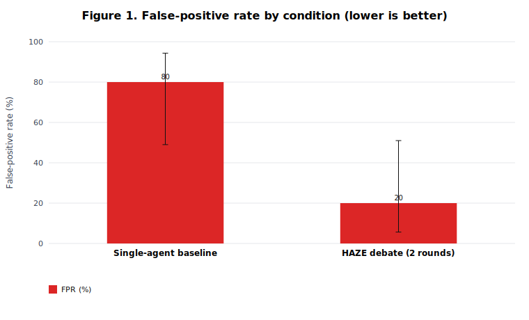
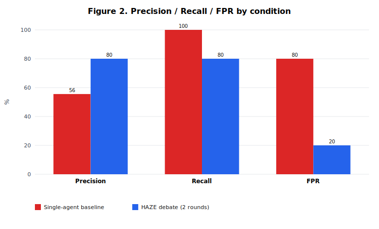

# Phase 1 validation results (VULNERABLE/SAFE framing)

> **Headline:** HAZE debate **80% recall · 20% FPR · 80% F1** vs single-agent baseline **100% recall · 80% FPR · 71.4% F1** (8/2/8/2 vs 10/8/2/0).

- Run: `run_phase1.mjs` — 120 tasks, ~9 min wall-clock, OpenRouter local harness
- Framing: `VULNERABLE` / `SAFE` (AppSec, not malware)
- Rounds: 1 (default post-ablation)
- Models: DeepSeek, Gemini-2.5-Flash, GPT-4o-mini, Llama-3.1-70B, Claude Sonnet 4.5

## Table 1 — Baseline vs HAZE (primary experiment)

| Condition | Precision | Recall | FPR | F1 | TP/FP/TN/FN | Status |
|---|---|---|---|---|---|---|
| Single-agent baseline | 55.6% [33.7, 75.4] | **100%** [72.2, 100] | **80.0%** [49.0, 94.3] | 71.4% | 10/8/2/0 | **Measured** |
| HAZE debate (1 round) | **80.0%** [49.0, 94.3] | 80.0% [49.0, 94.3] | **20.0%** [5.7, 51.0] | **80.0%** | 8/2/8/2 | **Measured** |

**McNemar (baseline vs debate):** discordant b=3, c=7, **p = 0.344** (n=20) — directionally favors debate (FPR 80%→20%) but underpowered at n=20.

## Interpretation

- Single-agent baseline **over-flags**: 8/10 patched artifacts falsely marked VULNERABLE (classic RLHF “find the bug” bias).
- HAZE debate **cuts FPR by 4×** (80%→20%) while trading 2 FN for 6 fewer FP — net accuracy 60%→80%.
- Class C framing errors largely resolved: patched C parsers now mostly SAFE under VULNERABLE/SAFE labels.
- Remaining 2 FP: CVE-2026-32625, CVE-2026-41089 (patched) — 1 debate repeat each flagged VULNERABLE.

