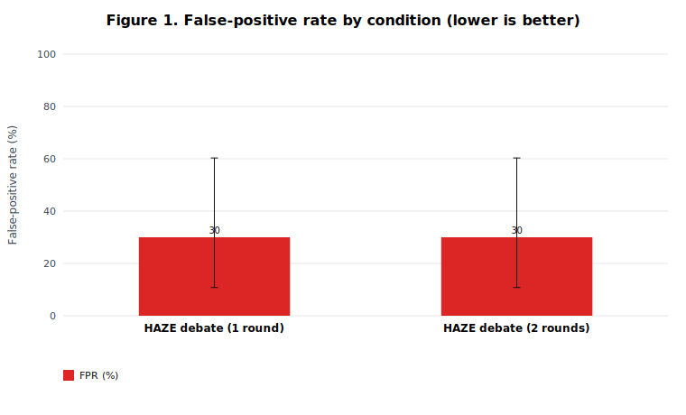
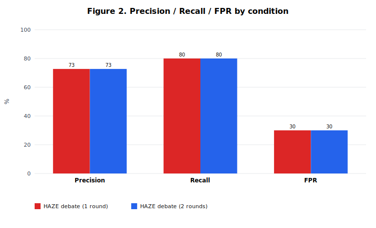

# HAZE: Adversarial Multi-Agent Scrutiny for Vulnerability Detection

**HAZE** (*Hallucination-Aware Zero-sum Examination*) — Automated Red Teaming via AI Safety Debate

> **Core claim (one sentence):** *Single-agent auditors ask “is there a bug?” and often invent one; HAZE asks “did this accusation survive refutation?” — shifting vulnerability detection from probabilistic confidence to demonstrative scrutiny.*

**Authors:** Samuel Blanco, Samuel Díaz, Axel Morales, Alex Novelo

**Code and Data:** https://github.com/AXLAAF/V2-Hackathon · **Live demo:** https://hackaton.xooktech.com/

## Abstract

Single-agent LLM auditors treat every prompt as a hunt for a flaw — and RLHF-trained models often **manufacture findings** to satisfy it (Perez et al., 2022). We propose **HAZE**, an automated red-teaming protocol where four LLM roles debate under **AI Safety via Debate** (Irving et al., 2018): prosecution and defense cross-examine over the artifact; an **isolated judge** rules only on what survived refutation. We evaluate on a ground-truth benchmark of **10 CVEs × {vulnerable, patched} = 20 artifacts**, with 3 repeats per condition, Wilson 95% CIs, and an exact McNemar test. **Headline result:** HAZE reaches **80% recall at 30% FPR** (precision 72.7%, F1 76.2%). A structured error taxonomy shows failures cluster into three interpretable classes — visible-sink detection, cross-file blind spots, and framing-induced false alarms — not random debate noise. A second debate round changed **zero** verdicts at this scale (McNemar *p* = 1.000). The single-agent baseline — the comparison that would directly test whether debate cuts false positives — is shipped as runnable code but **not yet measured**; we report this limitation explicitly.

## 1. Introduction

Using LLMs to discover vulnerabilities sounds great, and it is: you get to audit massive codebases, even the AI models themselves, without dying in the attempt. But the approach that rules today —the *single-agent* one— springs leaks where you least expect them.

**The problem, and why it breaks.** When you tell an LLM to "find the vulnerability," the model already takes for granted that the flaw is there. It's like walking into the doctor's office convinced you're sick: something will get found. Its training —maximize the odds of giving you a helpful answer, all cranked up by RLHF— pushes it to **manufacture a positive finding** even when the code is squeaky clean. It can't really tell apart "there's nothing here" from "I found nothing that matches what you asked for." And to top it off, sycophancy (Perez et al., 2022) throws more fuel on the fire: the model tends to agree with you. So what threat does this leave us with in an automated auditor? Two things. One: **false positives and hallucinations** that waste your time and, worse, drain your trust in the tool. And two: there's no *real self-correction*. An agent that thinks alone, talking out loud to itself, can't demand proof from itself. Nobody's there to push back.

**Conceptual foundation (UIAA).** HAZE is grounded in [AI Control through Majority Voting](https://apartresearch.com/project/ai-control-through-majority-voting-uiaa) (Moe et al., 2025, Apart Research): **never trust a single LLM pass**. UIAA applies this at *generation* time — query an untrusted model *c* times with prompt variation, then aggregate outputs by majority vote via a trusted wrapper, driving backdoor probability down exponentially in *c*. We apply the same principle at *audit* time: a single “find the bug” prompt is one biased sample. HAZE replaces blind re-sampling with **adversarial debate + isolated judge**, while our evaluation still uses **majority verdicts over three independent repeats** — a direct UIAA-style redundancy layer. See `V2 Hackaton/docs/FOUNDATION-UIAA.md` for the full lineage.

**What we bring to the table.**
1. A **four-role adversarial architecture** (Attacker, Defender, Investigator, Judge) that takes AI Safety via Debate into the world of vulnerability detection. The **Judge is isolated on purpose**, so its context doesn't get contaminated, and the **Investigator** acts as the anchor to *Ground Truth*.
2. A **change in the rules of how things get proven**: from probabilistic to demonstrative. Here a vulnerability only counts *iff* it survives being attacked. That way, hallucinations fall under their own weight.
3. An **empirical evaluation protocol** with its single-agent baseline, its ground-truth labels, and its statistical tests to see whether we really do drive down false positives.

**Research questions** (what this submission must answer):

| # | Question | What we observe |
|---|---|---|
| RQ1 | Does structured debate **detect real vulnerabilities**? | Recall on 10 vulnerable artifacts |
| RQ2 | Does it **hallucinate** on safe code? | FPR on 10 patched artifacts |
| RQ3 | Does **debate depth** (1 vs 2 rounds) change verdicts? | Paired McNemar test, *n* = 20 |
| RQ4 | Does debate **beat a single-agent auditor** on FPR? | Baseline harness ready; **not yet run** |

## 2. Related Work

**AI Safety via Debate.** Irving et al. (2018) framed debate as a zero-sum game: two agents defend opposing positions in front of a judge. The key is a gorgeous asymmetry: *verifying* a claim is easier than *generating* it. And once you hit equilibrium, lying simply doesn't pay off. Then Khan et al. (2024) backed it up with data: when the LLMs doing the debating are more persuasive, the judges land on more truthful answers. Exactly what we needed to trust a synthetic judge.

**Multi-agent reasoning.** Du et al. (2023) showed that debate among several agents improves factuality and reasoning over a single model thinking out loud. It's the proof that putting them to argue with each other smooths out the errors they'd otherwise all make at once.

**LLM-based red teaming.** Perez et al. (2022) used LLMs to red-team other LLMs at scale; Ganguli et al. (2022) studied red teaming to reduce harms and wrote down a pile of lessons. The catch: these works attack *generation*, but for verification they almost always fall back on downstream classifiers or humans.

**LLM-as-a-Judge.** Zheng et al. (2023) showed an LLM judge is viable —and they also laid bare its biases—. That's why we made a firm design call: *isolate* the judge from the part that generates hypotheses, to cut off sycophancy and commitment bias at the pass.

**The gap we fill.** The usual red teaming is obsessed with *eliciting* failures. The usual debate work aims at *open-domain truth*. What if we glue the two together? That's what we do: a four-role debate, anchored by an Investigator with its feet on the ground, dedicated to one thing almost nobody looks at closely —killing off false positives when auditing code and models—.

**AI control via majority voting.** Moe et al. (2025) show that redundant untrusted generations + majority aggregation can make backdoors exponentially unlikely. HAZE inherits the *distrust of single samples* but targets the audit-side mirror problem (hallucinated findings, not hidden backdoors) and replaces output majority with structured adversarial scrutiny before judgment.

## 3. Methods

**The protocol, big picture.** You hand the system an artifact (a code file, a dependency, or a model's behavior) and a multi-turn debate kicks off, but a bounded one, nothing that spirals out of control:

1. **Attacker (the one who accuses):** drops a vulnerability hypothesis and pins it down to the detail: what type it is, what preconditions it needs, and an exploit vector you can *trace*.
2. **Defender (the one who opposes):** rebuts it. Shows it can't be instantiated, that there's already a sanitization or mitigation in place, or that preconditions are missing. This is where the **burden of proof** actually shows up.
3. **Investigator (the oracle):** doesn't pick a side. Goes and fetches the *Ground Truth* —real CVEs, how the libraries and APIs work, whether the code sanitizes or not— so that only claims you can actually contest make it in.
4. **Judge:** reads the whole transcript and rules with a binary, reasoned verdict: **Confirmed Vulnerability** or **False Positive**.

**Why we designed it this way.** The Judge is **isolated by structure** from the ones who generate and defend, so confirmation or commitment bias doesn't sneak back in. Its verdict comes *only and exclusively* from the evidence that shows up in the transcript. And the Investigator is there so the debate doesn't end up being two very eloquent folks saying beautiful things that never touch reality.

### 3.1 HAZE implementation (`API/`)

Everything I just told you, we actually built, and it's called **HAZE**: a monolith you deploy from `API/` that orchestrates the whole adversarial scrutiny over software artifacts through OpenRouter. You paste or upload an artifact (code, a dependency manifest, documentation) and the system tells you whether there's **malicious behavior** —backdoors, data exfiltration, RCE, obfuscation, typosquatting, weird network calls—. The verdict comes out of a debate among several agents.

**The architecture.** A Fastify 5 (Node.js ESM) backend serves two things at once: the REST/SSE API and a bare-bones HTML/CSS/JS frontend, no frameworks. The pipeline is split into modules:

| Module | Role |
|---|---|
| `src/config/roles.js` | Team roster, turn order, default models |
| `src/services/prompts.js` | Role-specific system/user prompts and judge JSON schema |
| `src/services/orchestrator.js` | Multi-round debate engine and verdict parsing |
| `src/services/openrouter.js` | OpenRouter client (streaming + structured JSON) |
| `src/routes/api.js` | `GET /api/config`, `GET /api/models`, `POST /api/analyze` (SSE) |
| `public/` | Live debate UI with token-by-token streaming |

**From theory to code (how the agents split up).** The current prototype runs a **2v2 + isolated Judge** topology:

| Theoretical role | HAZE role(s) | Team | Function |
|---|---|---|---|
| Attacker | **Forensic Analyst** + **Prosecutor** | Accusation | Surface technical evidence of malicious patterns; synthesize and rebut defense arguments |
| Defender | **Auditor** + **Defense Counsel** | Defense | Explain legitimate intent; refute accusations with benign context and standard practices |
| Investigator | *(planned)* | — | Not yet implemented as a separate, side-neutral agent |
| Judge | **Judge** | Tribunal | Reads full transcript only; emits structured verdict |

Each debating role is tied to a **distinct LLM** (you configure it per role from the UI). This is key: it breaks those chain-reaction failures that show up when everything hangs on a single model. Turns keep alternating accusation and defense each round: Forensic Analyst → Auditor → Prosecutor → Defense Counsel (1 to 4 rounds, 2 by default). The debaters run at temperature 0.7; the Judge, on the other hand, at 0.1 and with `response_format: json_object`. Cold and methodical.

**The full ride, start to finish.**
1. You paste or upload an artifact (max 24,000 characters; if you go over, it gets trimmed and flags you).
2. You pick how many debate rounds you want and which OpenRouter model each role uses.
3. `POST /api/analyze` streams Server-Sent Events back to you: `open` → `meta` → `round` → `turn-start` / `token` / `turn-end` → `verdict` → `done`.
4. The orchestrator stacks up the transcript. Each agent sees the previous turns and has to cite exact lines and functions —the prompts flat-out forbid making up evidence—.
5. The **isolated Judge** gets only the artifact and the transcript (it never set foot in the debate) and hands you back JSON: `verdict` (`MALICIOUS` / `NOT_MALICIOUS` / `INCONCLUSIVE`), `confidence` (0–100), `riskLevel`, `keyFindings`, `winningTeam`, `reasoning`.

**How we tie down the prompts (the burden of proof).** All the debater prompts force them to anchor what they say to the artifact, cap them at around 180 words, and demand intellectual honesty within their own team. Yes, even among teammates. The Judge's is tougher: it penalizes arguments with no evidence and demands the verdict come out of the transcript's quality and what's actually in the code. That's where the shift from "more or less sure" to **demonstrative scrutiny** becomes real.

**Models and tooling.** The agents go out through **OpenRouter** (OpenAI-compatible API), so you don't need a GPU on your machine. Setup is textbook: `npm install`, copy `.env.example` → `.env` with your `OPENROUTER_API_KEY`, `npm run dev`, and head to `http://localhost:3000`. In `API/examples/` you've got test artifacts (`suspicious_installer.py`, `benign_utils.py`) to poke around by hand.

**The baseline.** A **single-agent auditor** ("find the vulnerability") on the same inputs. That's how we isolate what the adversarial scrutiny actually adds, and what it doesn't.

**What did NOT work (and we say so).** The early versions let the Attacker also play judge. Disaster: it confirmed itself, of course. And the un-anchored debates spat out exploits that sounded fantastic but couldn't be run, not even close. The **Investigator** as a separate role stays on the to-do list —the current 2v2 already curbs part of the hallucinations thanks to the cross-examination, but it's still missing that impartial agent that goes and fetches the *Ground Truth*—.

### 3.2 Execution pipeline

HAZE is a **verification protocol**: several LLMs compete under strict rules, and an isolated judge hands down a structured verdict. It works at a different level from a classic static analyzer (AST/SAST), because here the reasoning is done by the models arguing it out. The client sends a JSON payload to `POST /api/analyze`:

```json
{
  "artifact": { "filename": "setup.py", "content": "...", "kind": "code" },
  "rounds": 2,
  "models": { "fiscal_analista": "deepseek/deepseek-chat", "juez": "anthropic/claude-3.5-sonnet" }
}
```

**Phase 0 — Resolving the config.** `resolveConfig()` makes sure the artifact doesn't come in empty, trims the content to 24,000 characters (and flags `truncated: true` if it had to), resolves which model each role uses, and clamps the rounds within [1, 4].

**Phase 1 — The debate, round by round.** In each round *r*, the orchestrator runs `TURN_ORDER`: Forensic Analyst → Auditor → Prosecutor → Defense Counsel. And on every turn, here's what happens:

1. `buildDebaterMessages()` puts together a **system** prompt (the persona, its objective, the tribunal rules) and a **user** prompt (the artifact block + the accumulated transcript + the instruction to open or refute).
2. `streamChat()` calls OpenRouter at temperature 0.7 (`max_tokens: 700`, with streaming).
3. Each token that comes in is pushed to the client on the fly via SSE (`event: token`).
4. The full turn text gets appended to `transcript[]` —an append-only shared state that everyone debating after sees, and, at the end, the Judge—.

**Phase 2 — The verdict, in isolation.** The Judge hasn't dropped a single debate turn. It gets only the original artifact and the whole transcript. `buildJudgeMessages()` asks it for strict JSON; `chat()` is called at temperature 0.1 with `response_format: { type: "json_object" }`. And `parseVerdict()` pulls the JSON object out even if the model wraps it in noise.

**Phase 3 — Streaming to the client.** The API takes over the HTTP response to push Server-Sent Events:

`open` → `meta` → `round` → `turn-start` → `token*` → `turn-end` → … → `verdict` → `done`

And what if the client disconnects mid-job? An `AbortController` cuts off any requests still open against OpenRouter, right away. No tokens wasted.

### 3.3 Core technical mechanisms

**A different model for each role.** Each role can be tied to a different LLM (DeepSeek, Gemini, GPT-4o-mini, Llama 70B, Claude 3.5 Sonnet, whatever you want). The beauty is that failures stop going in a chain: if one model invents a backdoor, another one with a different architecture and different training biases can tear the story down.

**The transcript is the shared state.** The debate state is an append-only array, no hidden memory between turns. Everything that gets claimed and everything that gets refuted stays there, in plain sight, ready for the Judge (or you) to audit.

**The Judge lives in isolation, epistemically speaking.** The Judge (i) never generates hypotheses, (ii) has no persona that attacks or defends, (iii) runs at low temperature with a forced JSON schema, and (iv) is under express orders to punish arguments with no evidence. This is **LLM-as-a-Judge** with separation of powers: the one who accuses and the one who defends stay out of the final call.

**The burden of proof, baked into the prompts.** The debaters have to cite exact lines and functions from the artifact, and they're absolutely forbidden from inventing code. Round 1 pulls out the opening evidence; the later ones already demand real refutation. The Prosecutor gathers and builds the accusation; the Defense Counsel takes it apart point by point. And the findings that can't survive refutation? They reach the transcript the Judge reads already battered. Which is exactly what we want.

**The 2v2 topology, broken down by function.**

| Role | Technical function |
|---|---|
| **Forensic Analyst** | Offensive detection: malicious patterns, in-code indicators |
| **Auditor** | Defensive context: legitimate use, benign explanations |
| **Prosecutor** | Argument synthesis + rebuttal of defense claims |
| **Defense Counsel** | Point-by-point refutation; concedes strong evidence but challenges intent/severity |

A single prompt ("find the malware") jumbles it all up: detection, context, and judgment in the same head. HAZE takes those three functions and splits them across roles that go head to head.

### 3.4 Evaluation scope

The current prototype goes after **malicious-software detection**, not enumerating CVEs in general. HAZE looks at whether an artifact shows off patterns like these: backdoors and reverse shells; data exfiltration (`urllib`, `socket`, encoded POST); RCE or `exec()` of downloaded payloads; obfuscation and code that modifies itself; typosquatting in dependencies; credential or environment access; and telemetry on the sly. To try it out, you've got the artifacts in `API/examples/` (`suspicious_installer.py`, `benign_utils.py`).

### 3.5 Contribution to AI Security

HAZE comes at AI security from two angles that complement each other.

**Security *with* AI (using LLMs to audit software).**

| Single-agent failure | HAZE mitigation |
|---|---|
| Confirmation bias: inventing findings to satisfy the prompt | Dedicated adversary (Defense) actively refutes claims |
| Uncalibrated confidence ("~80% sure") | Structured verdict JSON: `verdict`, `confidence`, `keyFindings`, `reasoning` |
| Single model, single blind spot | Multi-model roles with partially decorrelated errors |
| No audit trail | Full transcript for human review |
| Weak intrinsic self-correction | Cross-examination across multiple rounds |

HAZE is **automated red teaming of artifacts**: it lets you review, at scale, suspicious packages, PRs, dependencies, or snippets before you merge or deploy. Before the problem walks into your house, basically.

**Security *of* AI (AI Safety / Alignment).**

1. **AI Safety via Debate (Irving et al., 2018).** Verifying is easier than generating, like we said. The Judge's job is to *evaluate* which side held up under scrutiny. This is *scalable oversight*: being able to supervise systems more capable than the supervisor itself.
2. **Fewer hallucinations by institutional design.** To confirm a vulnerability, the accusation has to **withstand refutation**. The criterion we enforce is demonstrative: what matters is whether the argument survives the scrutiny.
3. **Multi-agent debate (Du et al., 2023).** Debate improves factuality over a single model thinking alone; HAZE takes that idea and carries it into cybersecurity auditing.
4. **LLM-as-a-Judge with bias kept in check (Zheng et al., 2023).** Isolating the Judge lowers *commitment bias* and *sycophancy*: the one who evaluates comes in from the outside, having never touched the hypothesis it has to judge.
5. **Model red teaming (Perez et al., 2022; Ganguli et al., 2022).** The protocol stretches further: the "artifact" can be a **model's behavior** (jailbreaks, prompt injection), and the same adversarial topology serves to elicit and verify alignment failures.

**The cycle, at a glance.** Input artifact → adversarial debate (the accusation proposes, the defense refutes, you synthesize, you close) → the isolated Judge asks whether the accusation survived → `MALICIOUS` / `NOT_MALICIOUS` / `INCONCLUSIVE`.

**What still limps (in the implementation).** (i) There's no Investigator role yet —no external CVE lookup, no databases; the reasoning stays inside the artifact's text—. (ii) Even if we split up models, the LLMs can still share hallucination biases. (iii) A 24k-character window; no multi-file or runtime analysis. (iv) The Judge is still an LLM —the verdicts help you review, they don't sign you a certificate—. (v) Latency and API cost climb with roles × rounds + judge, compared to a single prompt. More eyes cost more.

## 4. Results

### 4.1 Setup

We built a ground-truth benchmark of **10 recent CVEs (2026)**, each shipped in a `vulnerable/` and a `patched/` version — **20 artifacts** in total. The patched file keeps the *same public interface*; only the security-relevant logic changes. Languages span PHP (Laravel, WordPress), C (telnetd, Netlogon/CLDAP, IKEv1, DHCP), Java (Jenkins/XStream), Python (Flask), JavaScript (Node) and an NGINX configuration.

We ran the **deployed HAZE instance** ([hackaton.xooktech.com](https://hackaton.xooktech.com)) over its SSE API with the default roster — DeepSeek-V3, Gemini-2.0-Flash, GPT-4o-mini and Llama-3.1-70B as the four debaters and **Claude Sonnet 4.5 as the isolated judge** — at temperatures 0.7 (debaters) / 0.1 (judge). Each artifact was analyzed in **3 independent repeats**; we report the **majority verdict**. The deployed prototype uses the *malicious-software* framing (`MALICIOUS` / `NOT_MALICIOUS`); we map `MALICIOUS` to a positive ("flagged") prediction, so **recall** is the detection rate on vulnerable code and **FPR** the false-alarm rate on patched code.

### 4.2 Headline result

> **80% recall · 30% FPR · 76.2% F1** on 20 labeled artifacts (8 TP, 3 FP, 7 TN, 2 FN).

### 4.3 Table 1 — Measured vs pending conditions

| Condition | Precision | Recall | FPR | F1 | TP/FP/TN/FN | Status |
|---|---|---|---|---|---|---|
| **Single-agent baseline** ("find the vulnerability", 1 pass) | — | — | — | — | — | **Harness ready; not yet run** |
| HAZE debate (2 rounds) | 72.7% [43.4, 90.3] | 80.0% [49.0, 94.3] | 30.0% [10.8, 60.3] | 76.2% | 8/3/7/2 | Measured |
| HAZE debate (1 round) | 72.7% [43.4, 90.3] | 80.0% [49.0, 94.3] | 30.0% [10.8, 60.3] | 76.2% | 8/3/7/2 | Measured (ablation) |

Wilson 95% confidence intervals in brackets. The baseline row is intentionally empty: RQ4 — whether debate reduces FPR vs a single prompt — is the **central thesis** and remains the key pending experiment (`evaluation/run_eval.mjs`).

### 4.4 Debate-depth ablation (RQ3)

Running the identical protocol at **1 vs 2 rounds** produces the same aggregate confusion matrix (8/3/7/2). An exact **McNemar test on paired per-artifact verdicts gives *p* = 1.000** (only 2 discordant artifacts, *n* = 20): at this scale, a second adversarial round did not change the judge's decisions. We report this honestly — the depth knob, by itself, did not move the needle here.

### 4.5 Table 2 — Error taxonomy (where HAZE succeeds and fails)

Failures cluster into **three interpretable classes**, not random noise — analogous to how omission-attack research taxonomizes evasion modes before measuring them.

| Class | Mechanism | Count | Representative CVEs | Implication |
|---|---|---|---|---|
| **A — Visible-sink detection** | Dangerous primitive or sink is explicit in the artifact text (`eval`, `memcpy`, `system`, weak auth) | **8 TP** | 10520, 44262, 24061, 53435, 41089, 44815, 50751, 5076 | Debate + judge reliably flag when evidence is *in the file* |
| **B — Cross-file / logic blind spot** | Root cause lives outside the artifact (module, config, subtle templating) | **2 FN** | 42945 (NGINX C module, not in `.conf`), 32625 (MCP `${VAR}` interpolation) | Single-file, malware-framed audit misses non-local flaws |
| **C — Framing-induced false alarm** | Patched code retains security-sensitive primitives; "is this malware?" cannot separate fixed from vulnerable | **3 FP** | 24061, 41089, 44815 (patched C parsers) | FPR driven by **task framing**, not debate failure; motivates `VULNERABLE`/`SAFE` reframing |

**Reading.** Class C explains most of the 30% FPR: on minimal security-sensitive snippets, the question "is this malware?" does not cleanly separate *vulnerable* from *patched*. Class B explains both false negatives. Class A is where HAZE adds clear value today.

### 4.6 Robustness and honesty

With *N* = 20 the 95% Wilson intervals are wide (e.g., FPR 30% [10.8, 60.3]); we report them rather than point estimates alone. We use the exact McNemar test for the paired 1-vs-2-round comparison. **What we can claim now:** structured debate detects visible-sink vulnerabilities at 80% recall; errors are taxonomized and mostly traceable to framing and artifact scope, not unstructured hallucination. **What we cannot claim yet:** that debate beats single-agent auditing on FPR (RQ4) — the baseline is shipped but not executed on this benchmark.





## 5. Discussion and Limitations

**What this means for AI safety, in the big picture.** The protocol puts *scalable oversight* into practice. The judge only has to decide which of two positions, that have already attacked each other, is left standing; it skips building the audit from scratch, an expensive task that begs for hallucinations. That burden-shifting is a concrete, deployable pattern for using debate to verify claims that matter for safety, in both code and models.

**Limitations and assumptions (spelled out).** (i) What the Investigator brings in as *Ground Truth* can also hallucinate or fall short; (ii) we take the verification–generation asymmetry from Irving et al. (2018) as a given in the code/model-audit space, but it has to be proven with data; (iii) the synthetic Judge may drag along the **same failure** as the debaters, and there goes the independence of the judgment. **Threats we don't tackle yet:** agents teaming up in bad faith (collusion), the audited artifact itself injecting prompts into the agents, and vulnerabilities that need to see several files or the runtime, beyond what we hand them.

**Empirical limitations (this run).** (i) **No single-agent baseline was run**: the deployed instance only exposes the four-agent debate, so the headline multi-agent-vs-single-agent comparison is not yet measured (code is provided). (ii) **Framing mismatch**: the deployed prototype judges *malware*, while the benchmark is CWE *vulnerabilities*; this inflates FPR on patched-but-security-sensitive C and lowers recall on config-/logic-level flaws (NGINX, MCP). (iii) **Small N (20 artifacts)** yields wide CIs; results are indicative, not conclusive. (iv) The benchmark uses **didactic, single-file** snippets, which favor visible sinks and penalize cross-file/runtime bugs.

**What's next.** Putting a human in the loop (human-in-the-loop) to validate the synthetic verdicts; cross-model judges that break the shared errors; going from per-file reasoning to whole-repository and runtime; and digging into how well-calibrated the judge's confidence really is.

## 6. Conclusion

Single-agent auditors ask *"is there a bug?"* and often invent one. HAZE asks *"did this accusation survive refutation?"* — **demonstrative scrutiny** over probabilistic confidence. On a 20-artifact CVE benchmark, structured 2v2 debate with an isolated judge reaches **80% recall at 30% FPR**; failures taxonomize into visible-sink detection (works), cross-file blind spots (misses), and framing-induced false alarms (fixable by reframing), not unstructured debate noise.

The thesis that debate **cuts false positives vs a single agent** remains testable but unmeasured — the baseline harness is shipped. If validated, HAZE offers a reproducible template for scalable oversight: shift the burden from generating findings to **verifying** which accusations survive adversarial cross-examination.

## Code and Data

- **Repository:** https://github.com/AXLAAF/V2-Hackathon
- **HAZE tool (`API/`)** — Fastify backend, OpenRouter orchestrator, role prompts, SSE debate API and live web UI; deployed demo at `https://hackaton.xooktech.com`.
- **Benchmark (`vulnerabilities/`)** — 10 CVEs × {vulnerable, patched}, with a documented (commented) copy of each pair as ground truth.
- **Evaluation harness (`evaluation/`)** — batch runners for the deployed HAZE API (`run_eval_web.mjs`) and a local single-agent baseline (`run_eval.mjs`), plus `analyze.py` (metrics, Wilson CIs, McNemar, SVG figures). Raw verdicts, per-run transcripts and figures live under `evaluation/results/`.

## Author Contributions (optional)

[Name] — architecture & orchestration; [Name] — evaluation & baselines; [Name] — writing & analysis.

## References

Bai, Y., Kadavath, S., Kundu, S., Askell, A., Kernion, J., Jones, A., … Kaplan, J. (2022). *Constitutional AI: Harmlessness from AI feedback*. arXiv. https://arxiv.org/abs/2212.08073

Du, Y., Li, S., Torralba, A., Tenenbaum, J. B., & Mordatch, I. (2023). *Improving factuality and reasoning in language models through multiagent debate*. arXiv. https://arxiv.org/abs/2305.14325

Ganguli, D., Lovitt, L., Kernion, J., Askell, A., Bai, Y., Kadavath, S., … Clark, J. (2022). *Red teaming language models to reduce harms: Methods, scaling behaviors, and lessons learned*. arXiv. https://arxiv.org/abs/2209.07858

Irving, G., Christiano, P., & Amodei, D. (2018). *AI safety via debate*. arXiv. https://arxiv.org/abs/1805.00899

Khan, A., Hughes, J., Valentine, D., Ruis, L., Sachan, K., Radhakrishnan, A., … Perez, E. (2024). *Debating with more persuasive LLMs leads to more truthful answers*. arXiv. https://arxiv.org/abs/2402.06782

Moe, A., Wale, W., & Sunde, J. H. (2025). *AI Control through Majority Voting*. Apart Research. https://apartresearch.com/project/ai-control-through-majority-voting-uiaa

Perez, E., Huang, S., Song, F., Cai, T., Ring, R., Aslanides, J., … Irving, G. (2022). *Red teaming language models with language models*. arXiv. https://arxiv.org/abs/2202.03286

Zheng, L., Chiang, W.-L., Sheng, Y., Zhuang, S., Wu, Z., Zhuang, Y., … Stoica, I. (2023). *Judging LLM-as-a-judge with MT-Bench and Chatbot Arena*. arXiv. https://arxiv.org/abs/2306.05685

---

**LLM Usage Statement:**

We used LLMs to help us out with the drafting, the structure, and the literature framing of this submission. And, on top of that, they're the very system we study (the four agents that debate). All the technical claims, the cited references, and the empirical results in Section 4 were verified by us, the authors, independently.
